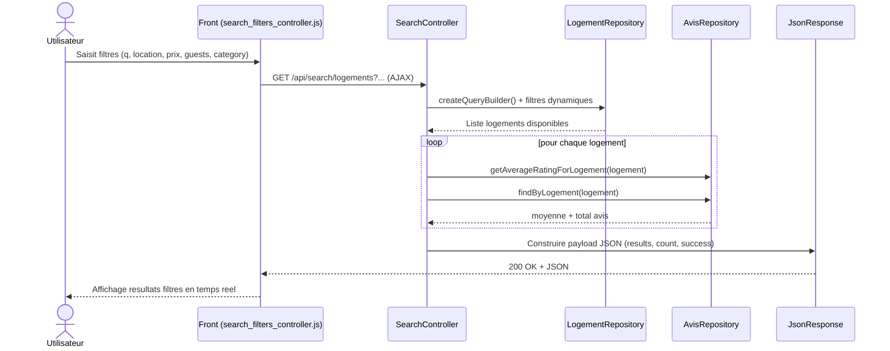

# Diagramme de sequence objets - Fonctionnalite avancee Sprint 1

Fonctionnalite choisie: **Recherche avancee API logements**

## Objets et responsabilites
- `SearchController`: orchestration des filtres et formatage de la reponse API.
- `LogementRepository`: requete SQL/Doctrine dynamique sur disponibilite + criteres.
- `AvisRepository`: enrichissement qualite (note moyenne, total avis).
- `Front controller JS`: declenchement requete asynchrone et rendu UI.

## Valeur metier
- Recherche plus rapide.
- Resultats plus pertinents.
- Meilleure experience utilisateur grace au filtrage instantane.
